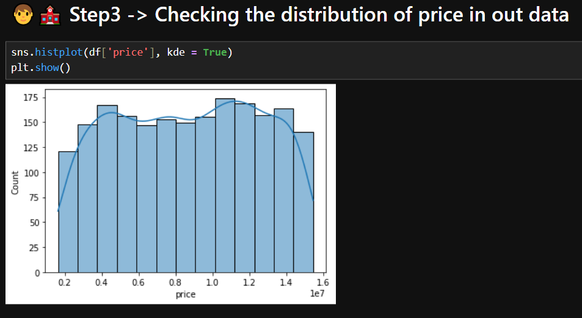
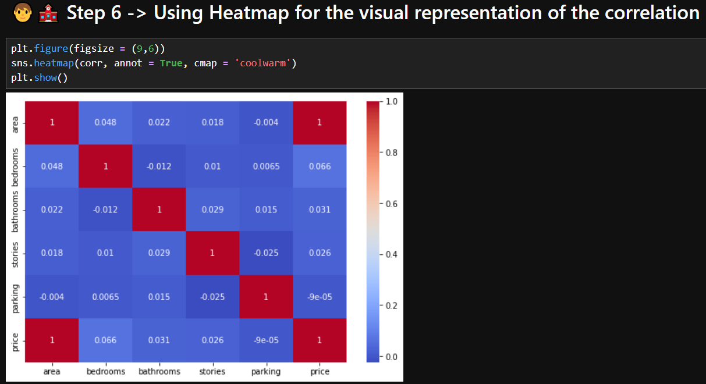
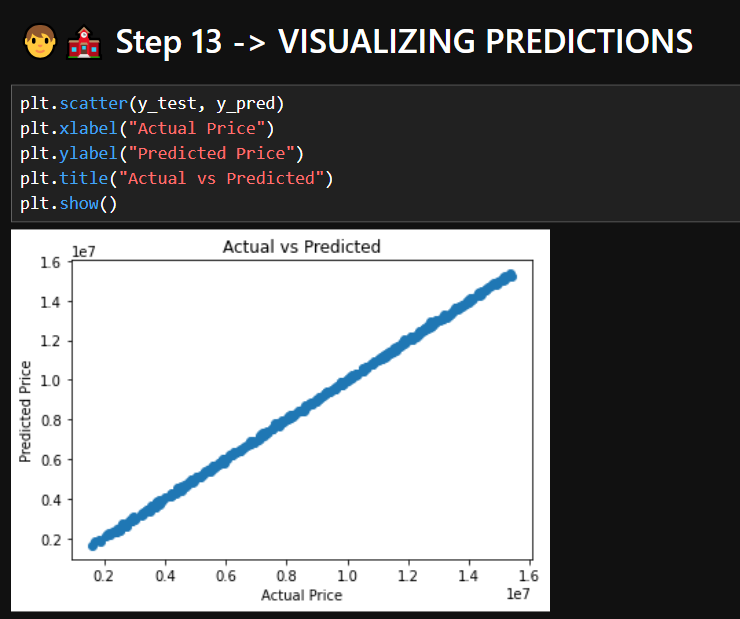
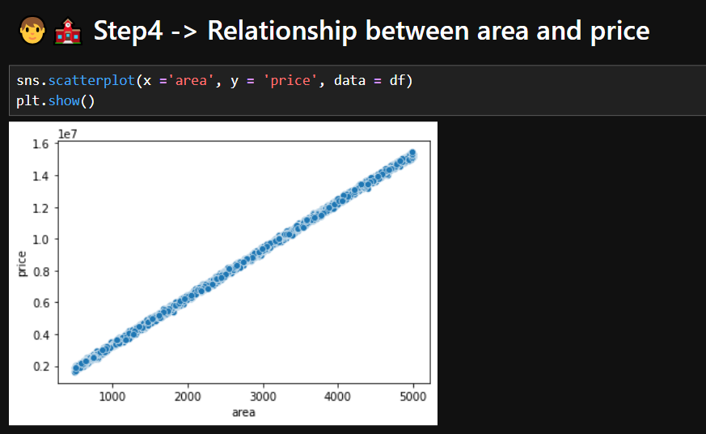

# house-price-prediction-ml
Machine Learning project for predicting house prices using Linear Regression

# 🏠 House Price Prediction (Machine Learning Project)

## 📌 Problem Statement
Predict house prices based on features like area, bedrooms, bathrooms, etc.

## 🧠 Techniques Used
- Linear Regression
- Data Analysis (EDA)
- Feature Engineering

## 📊 Results
- RMSE reduced from ~1,00,000 to ~50,000

## 🛠️ Tech Stack
- Python
- Pandas
- NumPy
- Scikit-learn
- Matplotlib / Seaborn

## 📸 Visualizations

### 📊 Price Distribution

### 🔥 Correlation Heatmap

### 🎯 Actual vs Predicted

### 📈 Area vs Price

## 🔗 Author
Prashant Maurya
